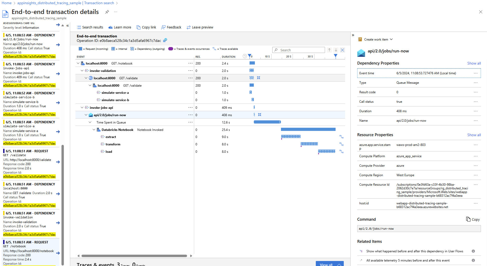

# Enabling Distributed Tracing for Python Notebooks: Unleashing the Power of Observability

This sample illustrates the collection of metrics, traces and logs accross various services and from within Databricks notebooks using OpenTelemetry.

It showcases a sample Flask-based API Orchestration service which can invoke a Databricks job and implements a robust distributed tracing solution using the OpenTelemetry library for Python. By leveraging distributed tracing, we aim to gain end-to-end visibility into request flows across our distributed system, enabling us to effectively diagnose and optimize performance, identify bottlenecks, and improve overall system reliability. OpenTelemetry provides a standardized and vendor-agnostic approach to distributed tracing, making it suitable for our architecture.

To trace requests across various services, we implemented trace context propagation. This involves adding trace identifiers to requests and propagating them across service boundaries. OpenTelemetry provides built-in mechanisms for propagating trace context, ensuring consistency and continuity of traces across different components.

We instrument our services using the OpenTelemetry library to automatically capture trace data. This will involve annotating key components and operations in our codebase to generate trace spans. These spans capture timing information, contextual data, and any relevant metadata associated with each operation. To capture traces that include interactions external APIs, and other dependencies, we integrate the OpenTelemetry library with relevant data stores and client libraries. This integration enables us to capture detailed traces of these interactions and identify performance bottlenecks or latency issues.

All of the data is pushed to Azure Monitoring using OpenTelemetry Azure Exporter to be able to visualize the data and support further analysis. In Azure Monitoring alerting and monitoring can be setup to ensure system health and performance. By setting thresholds for latency, error rates, or other performance indicators, we can trigger alerts when anomalies occur, enabling timely response and issue mitigation.

## The API service explained

This sample sets up a Flask-based Orchestration API service using the connexion library. The service is designed for a dummy ETL process and has 2 main endpoints:

- `/notebook`: invokes a Databricks job which runs a notebook. It first calls the `/validate` endpoint and consequently invokes the Databricks job. The notebook simulates ETL steps represented by artificial sleep durations.
- `/validate`: simulates a validation process by calling two external services, service A and service B. Both are represented by artificial sleep durations.
  
Both processes are not actually implemented but contain some dummy code (the artificial sleep durations) because the purpose of this sample is not showing the service itself but rather the integrated OpenTelemetry tracing. For the flow details please refer to [this diagram](./assets/flow.puml). In this sample you will see the logging of every step in the process, creating spans for various operations, and injecting trace contexts where needed, like in the Databricks job parameters.

## Guide to run the sample application

### Setting up Azure services

Go to your Azure Portal and manually create the following services:

- Azure Databricks;
- Application Insights.

When Azure Databricks is successfully deployed:

- Upload `notebooks/distributed_tracing.ipynb` notebook into your Databricks workspace.
- Copy your Connection string to Application Insights into the right variable (ref `connection_string_to_app_insights`) in the last cell of the notebook.
- Create a job that runs this notebook and copy the job id into line 55 of `api.py`.

### Importing env values

To import the .env values:

- Copy the .env.template file into an .env file and fill it as follows:
  - The DATABRICKS_ENDPOINT is the databricks URL and looks something like <https://adb-number.number2.azuredatabricks.net>
  - Go to the databricks endpoint, sign in with Azure AD and create yourself a databricks token in User Settings/Developer/Access Tokens. Use this token for the DATABRICKS_TOKEN value.
- To use ApplicationInsights tracing, update env variable APPLICATIONINSIGHTS_CONNECTION_STRING, which is used to setup the connection string for AppInsights. You can reuse the connection string from one of the webapps by copying it from the environment in the webapp in the portal.

## Run your application locally

Use the follow steps to get the Flask API service to run locally:

- `pip install -r requirements.txt`.
- cd to `distributed-tracing/app/app.py` and `python app.py`.
- navigate to http://localhost:5000/api/ui/

The Databricks notebook can be ran by executing the notebook endpoint. After a slight wait your results should be arriving in Application Insights and look like this:

