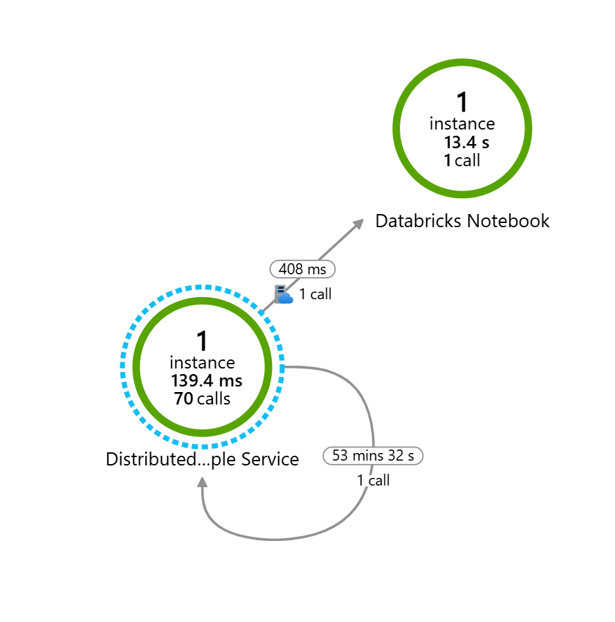

# Enabling Distributed Tracing for Python Notebooks: Unleashing the Power of Observability

This sample illustrates how to collect tracing spanning application boundaries, specifically a request originating in a Python application that triggers a Databricks notebook using OpenTelemetry.

It showcases a sample Flask-based API orchestration service that can invoke a Databricks job and implements a robust distributed tracing solution using the OpenTelemetry library for Python. By leveraging distributed tracing, we aim to gain end-to-end visibility into request flows across our distributed system. This enables us to effectively diagnose and optimize performance, identify bottlenecks, and improve overall system reliability. OpenTelemetry provides a standardized and vendor-agnostic approach to distributed tracing, making it suitable for our architecture.




## Key Concepts

### Trace Context Propagation

To trace requests across various services, we implemented trace context propagation. This involves adding trace identifiers to requests and propagating them across service boundaries. OpenTelemetry provides built-in mechanisms for propagating trace context, ensuring consistency and continuity of traces across different components. However, in our case we needed to manually pass along the trace context along with creation of trace spans with correct types.

### Instrumentation

We instrument our services using the OpenTelemetry library to automatically capture trace data. This involves annotating key components and operations in our codebase to generate trace spans. These spans capture timing information, contextual data, and relevant metadata associated with each operation. By integrating the OpenTelemetry library with relevant data stores and client libraries, we capture detailed traces of interactions with external APIs and other dependencies, enabling us to identify performance bottlenecks or latency issues.

### Azure Monitoring

All data is pushed to Azure Monitoring using the OpenTelemetry Azure Exporter to visualize the data and support further analysis. In Azure Monitoring, alerting and monitoring can be set up to ensure system health and performance. By setting thresholds for latency, error rates, or other performance indicators, we can trigger alerts when anomalies occur, enabling timely responses and issue mitigation.

## The API Service Explained

This sample sets up a Flask-based orchestration API service designed for a dummy ETL process with two main endpoints:

- `/notebook`: Invokes a Databricks job which runs a notebook. It first calls the `/validate` endpoint and then invokes the Databricks job. The notebook simulates ETL steps with artificial sleep durations.
- `/validate`: Simulates a validation process by calling two external services, Service A and Service B, both represented by artificial sleep durations.
  


These processes contain dummy code (artificial sleep durations) because the purpose of this sample is to showcase integrated OpenTelemetry tracing. You will see the logging of every step in the process, creating spans for various operations, and injecting trace contexts where needed, such as in the Databricks job parameters.

## Propagation Explained

The crucial code is in `app/api.py` in the `notebook` method. To support the flow of traces from the Python application to our notebook/job, we need to retrieve the last span context and pass it along to the external application. The external application can then start a new span with the passed-in span context to join the same tracing context, giving us a trace that flows across the application boundary.

The out-of-the-box OpenTelemetry `request` integration creates a new span and passes it along as a header, but we cannot use that as the span information will be in the HTTP request header and will not propagate to the underlying notebook/job. Hence, we will suppress the `request` integration to avoid automatic span creation by using the `OTEL_PYTHON_EXCLUDED_URLS=azuredatabricks.net/api/2.0/jobs/run-now` environment variable. Once this is suppressed, we will manually create the span, set the necessary span information, and pass the context along as a job parameter to Databricks.

Inside the notebook, we will pick up the context from the parameter and start a span. All nested spans created, regardless of whether they are in a library or directly in the notebook, will join the existing trace context, giving us a complete distributed trace across application boundaries. The notebook also shows how to ensure that spans are joined in distributed tracing even if they are in multiple cells.

This sample also illustrates how to capture the time taken between when the job request was posted and when the job was executed. This is done using `SpanKind.PRODUCER` for the application and `SpanKind.CONSUMER` in the notebook.

## Getting Started

### Prerequisites

- [Azure CLI](https://learn.microsoft.com/cli/azure/install-azure-cli)
- [Terraform](https://www.terraform.io/downloads.html)

Note: You can also use [Azure Cloud Shell](https://learn.microsoft.com/en-us/azure/cloud-shell/overview) to avoid installing software locally.

### Installation

1. Clone the repository:
   ```shell
   git clone https://github.com/Azure-Samples/databricks-observability.git
   ```

2. Navigate to the directory:
   ```shell
   cd databricks-observability/distributed-tracing
   ```

3. Log in with Azure CLI (skip this step if using Azure Cloud Shell):
   ```shell
   az login
   ```

4. Run the following commands:
   ```shell
   terraform init
   terraform apply
   ```

   When prompted, answer `yes` to deploy the solution.

In case transient deployment errors are reported, run the `terraform apply` command again.

> There might be a timeout during the `null_resource.deploy_app` resource creation. Please re-run `terraform apply` and it should be fine. You can also run the application locally. The `.env` file is patched with all the necessary values during Terraform resource creation.

### Deployed Resources

The sample deploys the following Azure resources:

- Databricks workspace
- App service
- Linux web app

### Using the Sample

Once Terraform is deployed, it outputs `application_endpoint`. You can access this endpoint using a browser. The Databricks notebook can be run by executing the notebook endpoint. After a slight wait, your results should appear in Application Insights and look like this:

The `app` folder contains the necessary code with an updated .env file, which you can run locally.

## Destroying the Solution

To destroy the deployed resources, run:
```shell
terraform destroy
```
