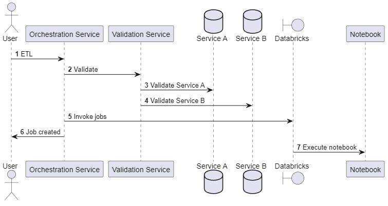

# Enabling Distributed Tracing for Python Notebooks: Unleashing the Power of Observability

This sample illustrates the how to collect tracing spanning application boundary. Specifically a request originating in a python application triggering a Databricks notebooks using OpenTelemetry.

It showcases a sample Flask-based API Orchestration service which can invoke a Databricks job and implements a robust distributed tracing solution using the OpenTelemetry library for Python. By leveraging distributed tracing, we aim to gain end-to-end visibility into request flows across our distributed system, enabling us to effectively diagnose and optimize performance, identify bottlenecks, and improve overall system reliability. OpenTelemetry provides a standardized and vendor-agnostic approach to distributed tracing, making it suitable for our architecture.

To trace requests across various services, we implemented trace context propagation. This involves adding trace identifiers to requests and propagating them across service boundaries. OpenTelemetry provides built-in mechanisms for propagating trace context, ensuring consistency and continuity of traces across different components.

We instrument our services using the OpenTelemetry library to automatically capture trace data. This will involve annotating key components and operations in our codebase to generate trace spans. These spans capture timing information, contextual data, and any relevant metadata associated with each operation. To capture traces that include interactions external APIs, and other dependencies, we integrate the OpenTelemetry library with relevant data stores and client libraries. This integration enables us to capture detailed traces of these interactions and identify performance bottlenecks or latency issues.

All of the data is pushed to Azure Monitoring using OpenTelemetry Azure Exporter to be able to visualize the data and support further analysis. In Azure Monitoring alerting and monitoring can be setup to ensure system health and performance. By setting thresholds for latency, error rates, or other performance indicators, we can trigger alerts when anomalies occur, enabling timely response and issue mitigation.

## The API service explained

This sample sets up a Flask-based Orchestration API service. The service is designed for a dummy ETL process and has 2 main endpoints:

- `/notebook`: invokes a Databricks job which runs a notebook. It first calls the `/validate` endpoint and consequently invokes the Databricks job. The notebook simulates ETL steps represented by artificial sleep durations.
- `/validate`: simulates a validation process by calling two external services, service A and service B. Both are represented by artificial sleep durations.
  


Both processes are not actually implemented but contain some dummy code (the artificial sleep durations) because the purpose of this sample is not showing the service itself but rather the integrated OpenTelemetry tracing. In this sample you will see the logging of every step in the process, creating spans for various operations, and injecting trace contexts where needed, like in the Databricks job parameters.

## Propagation explained

The crucial bit of code is in `app/api.py` in the ```notebook``` method. We are doing two major things to support flowing of traces from the python application to our notebook/job. We know that in order for distributed traces to work and flow across application boundaries, we need to retrieve the last span context and pass it along to the external application. The external application can then start a new span with the passed in span context to join the same tracing context, giving us a trace which flows across application boundary.

The out-of-the-box OpenTelemetry `request` integration creates a new span and passes it along as a header, but, we cannot use that, as the span information will be in the HTTP request header and will not be propagated to the underlying notebook/job. Hence we will be suppressing the `request` integration so that it does not create a new span automatically by using ```OTEL_PYTHON_EXCLUDED_URLS=azuredatabricks.net/api/2.0/jobs/run-now``` environment variable. Once this is suppressed, we will manually create the span and set the necessary span information and pass the context along as a job parameter to the databricks.

Inside the notebook, we will pick up the context from the parameter and start a span. All nested spans created regardless if it is in a library or directly on the notebook will join the existing trace context, giving us a complete distributed trace across application boundary. The notebook also showcases how to ensure that spans are joining distributed tracing even if they are in multiple cells.

The sample also illustrates how to capture the time taken between the job request was posted and the job was executed. This is done using ```SpanKind.PRODUCER``` for the application and ```SpanKind.CONSUMER``` in the notebook.

## Getting Started

### Prerequisites

- [Azure CLI](https://learn.microsoft.com/cli/azure/install-azure-cli)
- [Terraform](https://www.terraform.io/downloads.html)

Note: you can also use [Azure Cloud Shell](https://learn.microsoft.com/en-us/azure/cloud-shell/overview) to avoid having to install software locally.

### Installation

- `git clone https://github.com/Azure-Samples/databricks-observability.git`

- `cd distributed-tracing`

- Log in with Azure CLI *(in Azure Cloud Shell, skip this step)*:

  ```shell
  az login
  ```

- Run:

  ```shell
  terraform init
  terraform apply
  ```

  When prompted, answer `yes` to deploy the solution.

In case transient deployment errors are reported, run the `terraform apply` command again.

> There might be timeout during the `null_resource.deploy_app` resource creation. Please re-run ```terraform apply``` and it should be fine. You can also run the application locally. The `.env` file is patched with all the necessary values during terraform resource creation.

### Deployed resources

The sample deploys the following Azure resources:

- Databricks workspace
- App service
- Linux web app

### Using the sample

Once the terraform is deployed, it outputs ```application_endpoint```. You can access this endpoint using the browser. The Databricks notebook can be ran by executing the notebook endpoint. After a slight wait your results should be arriving in Application Insights and look like this:


The `app` folder also contains the necessary code with updated .env file which you can run locally.

## Destroying the solution

Run:

```shell
terraform destroy
```
